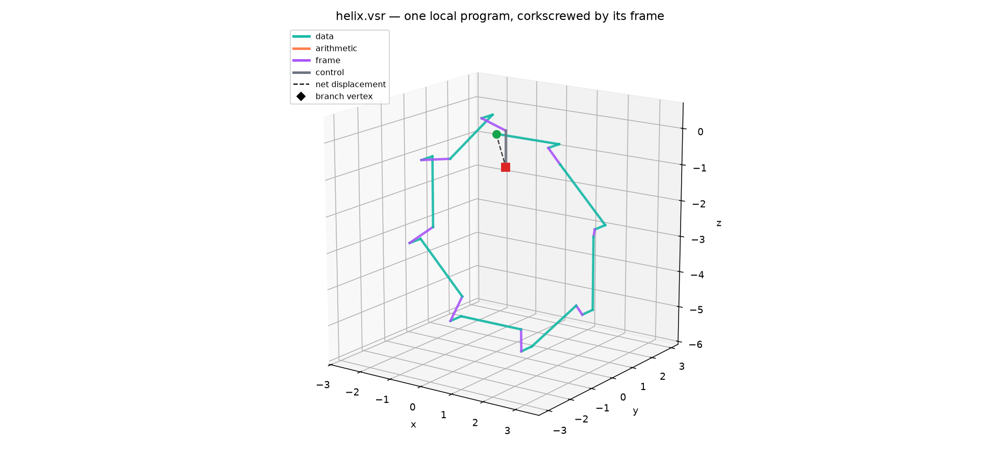
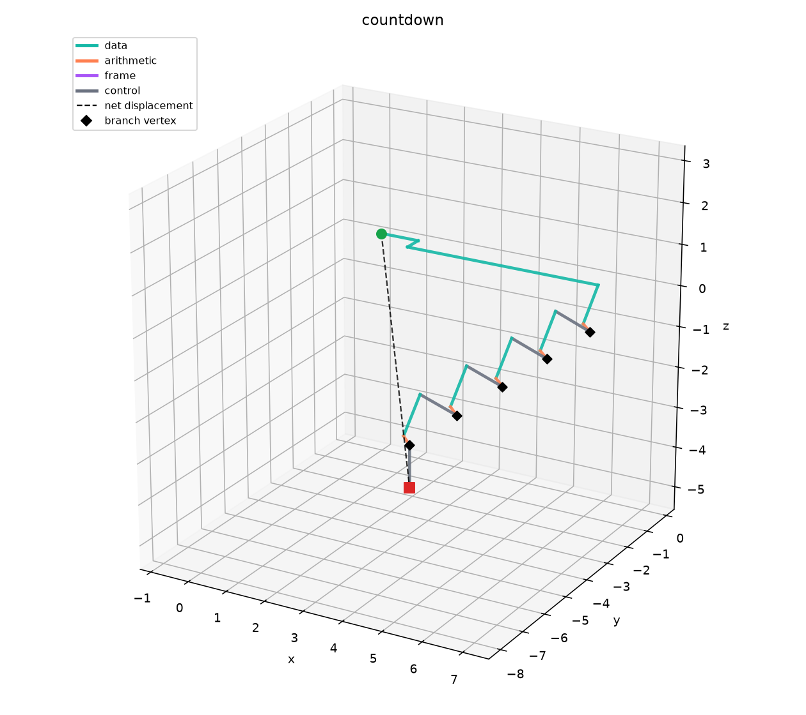
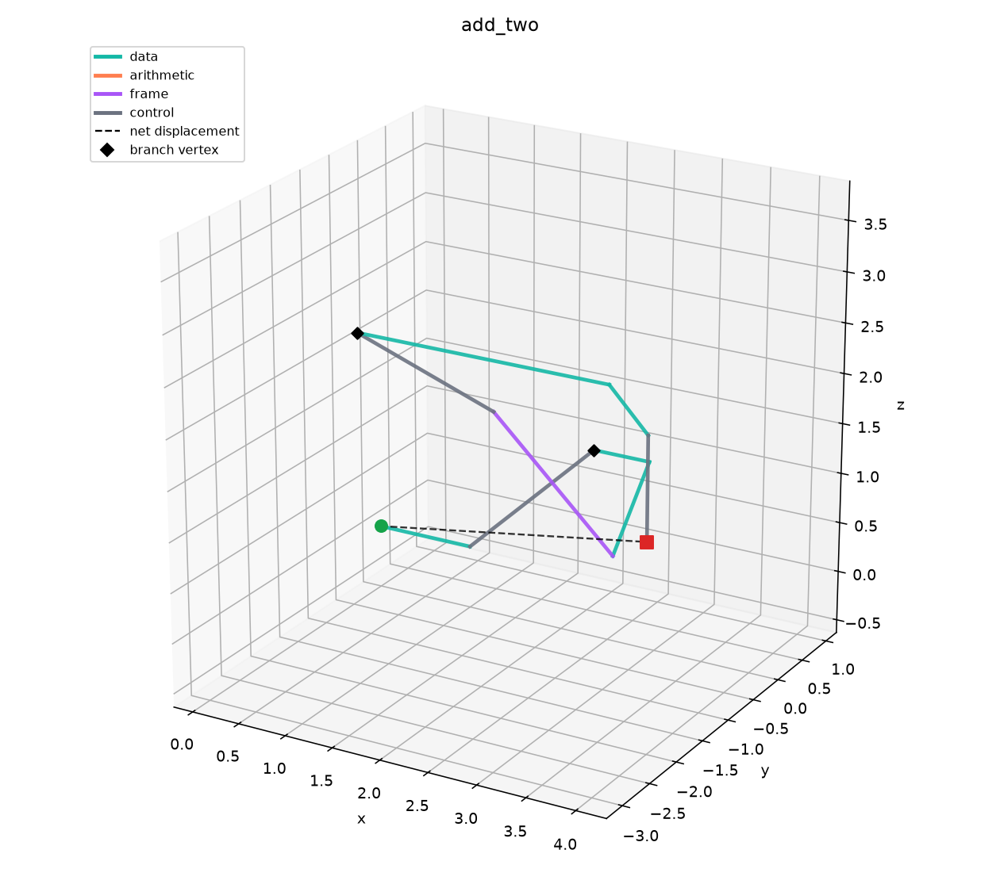
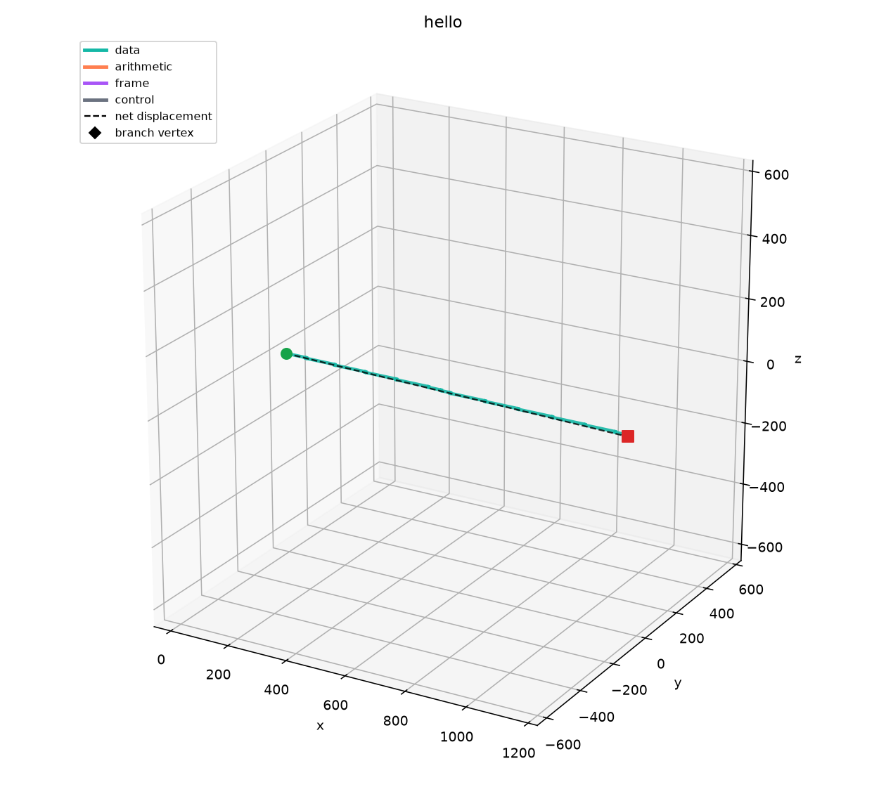
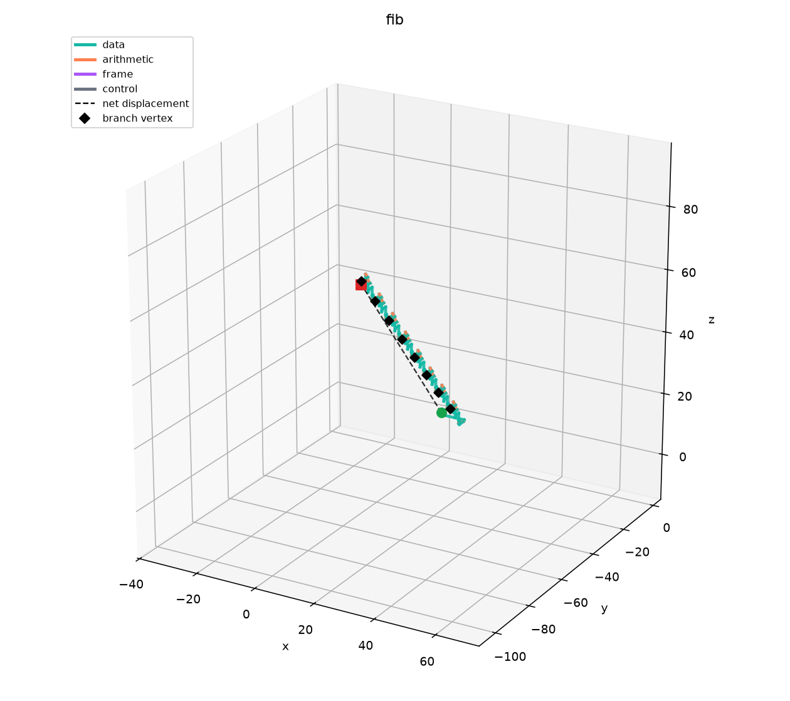
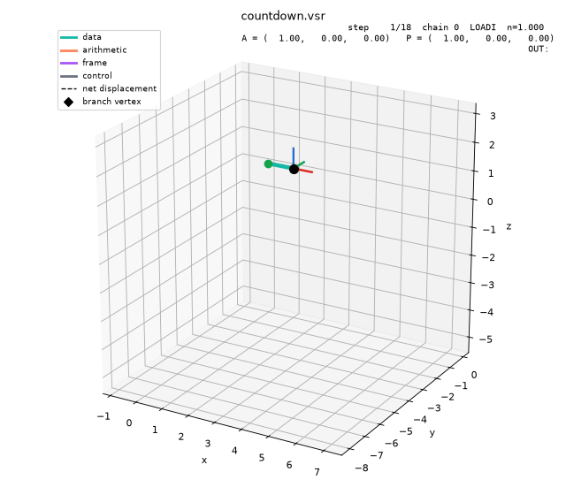
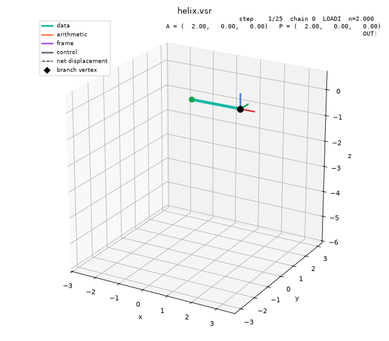
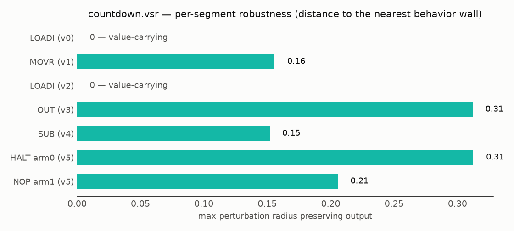
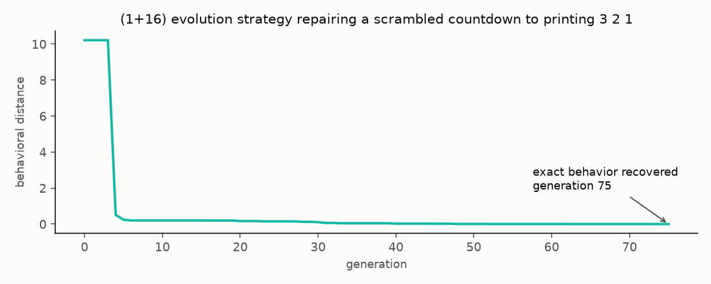
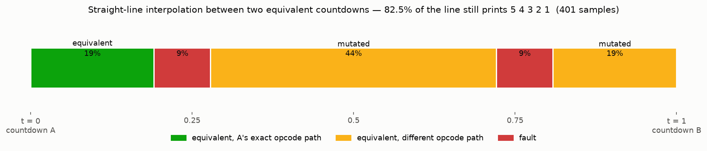

<div align="center">


# VERSOR

### A language where the program is the path.

Every instruction is a vector: its direction selects the opcode, its magnitude is
the operand, and a quaternion frame decides what everything means. Programs are
polylines through 3D space; memory is space itself; a function's return value is
its net displacement. This is the reference implementation — interpreter,
assembler, a tiny high-level language, 3D execution visualizer, physical
export, and continuous program-space tools.
**[Try it in the browser →](https://sharpclaw007.github.io/versor/playground/)**

[](https://sharpclaw007.github.io/versor/playground/)
[](https://github.com/SharpClaw007/versor/actions/workflows/ci.yml)
[](https://www.python.org/)
[](https://numpy.org/)
[](versor-design.md)
[](docs/whitepaper.md)
[](LICENSE)

<br />



</div>

---

## Overview

**Versor** (n.) — in geometric algebra, a unit multivector that enacts a rotation.
Here: the machine's orientation frame, the thing that turns raw vectors into meaning.

The machine walks a polyline. Each segment is decoded *relative to the current
frame* — rotate the frame and the same raw vectors downstream mean different
instructions. Because 3D rotations don't commute, frame rotation is the
expressive core of the language: the hero image above is one identical
frame-local program repeated eight times, corkscrewed through world space purely
by an accumulating twist. Full language definition in
[`versor-design.md`](versor-design.md); the mathematics — quaternion double
cover, decoding as sphere partitions, the frame-covariance theorem, loops as
screw motions, and the geometry of program space — is worked out in the
[whitepaper](docs/whitepaper.md), with every numeric claim reproduced by
[`docs/calcs.py`](docs/calcs.py).

## Features

- **Vector ISA** — direction quantized against the frame picks the opcode;
  magnitude is the immediate operand. Four pluggable decoders: `cubic26`
  (26 opcodes, component thresholds), `icosa32` and `sphere32` (the full
  **Versor-32** ISA: + INP/SWAP, PUSHA/POPA, MULR/LOADP on the extra
  icosahedral cones), and `sphere26` (optimized base-26 packing). The
  nearest-neighbor decoders put ~91–92% of the sphere in play vs cubic's 72%.
- **Executable memory** — `EXEC` (LOAD with n ≥ 2) runs the arrival cell's
  stored vector under the live frame, movement included: chained EXECs walk
  code laid down in space by STORE. Self-modifying programs, spec Q4.
- **Sim(3) scale channel** — `CALL chain 0.55` scales the callee's whole
  geometry; RET restores it. Self-similar recursion from the call stack
  (`zoom.vsr`), spec Q2.
- **Orientation frame** — a unit quaternion the program itself rotates with
  **ROTF/ROTG/ROTH**; non-commutativity of SO(3) is a feature, not a bug.
- **Functions are shapes** — `CALL` executes a stored chain under the caller's
  live frame: *orientation is the argument*, net displacement is the return value.
- **Memory is space** — values live at spatial cells, the machine's position is
  the pointer, and walking is pointer arithmetic.
- **Loops are helices** — a loop is literally a cycle in the chain graph; in
  space each lap is the same shape translated by the body's net displacement.
- **First-class visualizer** — every run can render its trace (segments colored
  by opcode class, branch diamonds, dashed net-displacement chord) or an
  execution GIF with a machine cursor, live frame triad, and a step/opcode/
  accumulator/OUT HUD.
- **Fluent builder** — authors programs in frame-local intent and tracks the
  authoring frame, so helpers still emit correct raw vectors after rotations.
- **Assembler** — a text syntax (`.vasm`) with labels, named chains, guard
  shorthand, and `pi`-expression angles; `versor asm` compiles it to `.vsr`,
  and `versor run` executes it directly.
- **VHL** — a tiny high-level language (`let` / `print` / `repeat` with full
  expression arithmetic) compiling to chains; register allocation is a
  3-slot pool because spilling to positional memory is literally a
  path-planning problem (`versor/vhl.py`).
- **Browser playground** — the interpreter and assembler ported to JS
  ([bit-parity with Python enforced in CI](docs/playground/test/)), with an
  orbitable three.js trace, live frame triad, and step/opcode/OUT HUD.
- **Turing complete, mechanized** — `versor/minsky.py` compiles two-counter
  Minsky machines to chains; the reduction runs end to end in the tests.
- **Continuous program space** — a program is a point of ℝ^{3m}: interpolate
  between implementations, measure per-segment robustness, and repair
  scrambled programs with an evolution strategy (`versor/synth.py`).
- **Physical export** — a run is a toolpath: `versor export` emits G-code
  (plot a computation on a pen plotter), OBJ polylines, and printable STL
  tube meshes.
- **Load-time lint + located faults** — dead-zone warnings at load;
  `AmbiguousDirection`, `DivisionByZero`, `CallStackOverflow`, `StackUnderflow`,
  `StepBudgetExhausted` and friends carry step/chain/vertex.

## Showcase

<table>
  <tr>
    <td width="50%">
      <br />
      <sub><b>countdown.vsr</b> — a loop is a cycle in the graph; the trace shows each lap as the same shape, translated. Prints 5 4 3 2 1.</sub>
    </td>
    <td width="50%">
      <br />
      <sub><b>add_two.vsr</b> — the same function called twice; a π frame rotation (purple) flips its branch, so the two calls sweep different displacements. Prints 0.6, then −2.5.</sub>
    </td>
  </tr>
  <tr>
    <td width="50%">
      <br />
      <sub><b>hello.vsr</b> — OUT in char mode; the program is the skyline of its character codes. Prints <code>Hello, world!</code></sub>
    </td>
    <td width="50%">
      <br />
      <sub><b>fib.vsr</b> — iterative Fibonacci in four registers; the counter's decrement unit is minted each lap by NORMing the counter itself. Prints 1 2 3 5 8 13 21 34.</sub>
    </td>
  </tr>
</table>

> Every image is a real execution trace rendered by `versor/viz.py` — regenerate
> them all with `python examples/make_examples.py`.

### Watch it compute

`versor run FILE --animate out.gif` renders the execution itself: the path
grows step by step, the black cursor is the machine, the RGB triad is the live
orientation frame `F` (watch it twist on every purple segment), and the HUD
tracks step, opcode, accumulator, and the OUT buffer.

<table>
  <tr>
    <td width="50%">
      <br />
      <sub><b>countdown.vsr</b> — five laps of the cycle; the HUD's OUT line fills up as the loop drains the accumulator.</sub>
    </td>
    <td width="50%">
      <br />
      <sub><b>helix.vsr</b> — the triad turns 45° per lap, so the same frame-local instructions corkscrew through world space.</sub>
    </td>
  </tr>
</table>

## Tech stack

| Layer         | Technology                                                        |
|---------------|-------------------------------------------------------------------|
| Language      | [Python](https://www.python.org/) 3.11+                           |
| Numerics      | [NumPy](https://numpy.org/) + hand-rolled unit quaternions        |
| Visualization | [Matplotlib](https://matplotlib.org/) (3D traces, GIF animation)  |
| Testing       | [pytest](https://docs.pytest.org/)                                |

## Project structure

```
versor/
├── quat.py        # Hand-rolled unit quaternions
├── decode.py      # Pluggable decoders: cubic26, icosa32, sphere26
├── isa.py         # Opcode table: sign triple -> handler
├── machine.py     # Machine state + step() + run()
├── loader.py      # .vsr JSON <-> chain graphs, validation, lint
├── builder.py     # Fluent authoring API with frame tracking
├── asm.py         # .vasm text assembler (front-end over the builder)
├── vhl.py         # VHL: let/print/repeat -> chains
├── minsky.py      # Two-counter Minsky machines -> chains (spec Q1)
├── interp.py      # Program-space lerp + interpolant classification
├── synth.py       # Robustness maps + (1+lambda) evolutionary search
├── export.py      # G-code / OBJ / STL export of executed traces
├── trace.py       # Per-step execution records
├── viz.py         # 3D renders + execution GIFs
├── cli.py         # python -m versor run|asm|vhl|export|lint
└── examples.py    # The milestone programs, one source of truth
docs/
├── whitepaper.md  # The mathematics (+ calcs.py reproducing every number)
└── playground/    # Browser playground: JS port + three.js, parity-tested
tests/             # 172 tests: everything above, incl. milestone acceptance
examples/          # .vsr / .vasm / .vhl programs, renders, demo scripts
tools/             # sphere26 optimizer, golden-file generator
tooling/           # .vasm TextMate grammar
```

## Getting started

| Requirement | Version | Notes                        |
|-------------|---------|------------------------------|
| Python      | 3.11+   | 3.14 tested                  |

```bash
python3 -m venv .venv && .venv/bin/pip install -e '.[dev]'
```

| Command                                        | Description                              |
|------------------------------------------------|------------------------------------------|
| `python -m versor run FILE.vsr`                | Run a program (also accepts `.vasm`)     |
| `python -m versor run FILE.vsr --trace out.png`| Also render the executed path            |
| `python -m versor run FILE.vsr --animate out.gif` | Execution GIF (cursor, frame triad, HUD); `--fps`, `--spin` |
| `python -m versor run FILE.vsr --decoder icosa32` | Override the program's decoder        |
| `python -m versor run FILE.vsr --input 6,7`    | Feed scalars to `INP` (`--input-text` for chars) |
| `python -m versor asm FILE.vasm [-o out.vsr]`  | Assemble Versor assembly to `.vsr`       |
| `python -m versor vhl FILE.vhl [-o out.vsr]`   | Compile VHL to `.vsr` (run also takes `.vhl`) |
| `python -m versor export FILE --gcode/--obj/--stl` | Toolpath / mesh export of a run      |
| `python -m versor lint FILE.vsr`               | Validate + dead-zone lint                |
| `python examples/make_examples.py`             | Regenerate all example .vsr + renders    |
| `python examples/interpolate.py`               | Regenerate the interpolation study       |
| `python examples/synthesize.py`                | Regenerate robustness + evolution plots  |
| `python -m pytest`                             | Run the test suite                       |

Programs are authored in Versor assembly (hand-writing raw vectors is possible
but masochistic):

```asm
.name countdown

.chain entry
        LOADI 1
        MOVR r0                          ; R0 = unit decrement
        LOADI 5                          ; A = counter
loop:   OUT
        SUB r0
        BR -x: HALT -> end, +x: NOP -> loop
        ; exit listed first: wins the tie when A hits (0,0,0)
```

```bash
$ python -m versor run examples/countdown.vasm
5
4
3
2
1
```

...or with the Python builder, which the assembler compiles down to:

```python
from versor import ProgramBuilder, Machine, arm

b = ProgramBuilder("countdown")
c = b.chain("entry")
c.loadi(1).movr(0).loadi(5)
c.label("loop")
c.out().sub(0)
c.branch(
    arm("HALT", 1.0, guard=(-1, 0, 0), to="end"),
    arm("NOP", 1.0, guard=(1, 0, 0), to="loop"),
)
print(Machine(b.build()).run().out)   # [5.0, 4.0, 3.0, 2.0, 1.0]
```

Both front-ends track an *authoring frame*: after `ROTH pi` (or `c.roth(pi)`),
later instructions emit raw vectors pre-rotated so they still decode to the
intended opcode at runtime — see [`examples/add_two.vasm`](examples/add_two.vasm)
for chains, `CALL` by name, and frame rotation in assembly.

## Semantics notes

<details>
<summary><strong>Design decisions — spec ambiguities resolved in v0.1</strong></summary>

1. **Scalar A.x is frame-local.** OUT, JMPP, and DOT's x-slot read/write
   `(F⁻¹AF).x`, consistent with LOADI's `A = F·(n,0,0)·F⁻¹`. Required for M1
   frame covariance: a chain rotated together with its frame produces identical
   output.
2. **Non-root chain end = implicit RET** (spec §5 wins over the literal §3.2
   step 6). Only running off the root chain halts.
3. **Move-then-execute.** `P += v_raw` happens before the handler runs:
   STORE/LOAD address the *arrival* cell, CALL pushes the post-move position,
   RET computes displacement after its own move. Consequence: the returned
   displacement is exactly the callee's swept segments (including its RET
   segment, excluding the caller's CALL segment).
4. **Zero-accumulator branch:** `A_normalized` is taken as the zero vector, all
   guard dots are 0, and the tie rule picks the first listed edge. Countdown
   exits by listing its exit edge first.
5. **RET restores the caller's frame** (that is why CALL pushes it); frame
   changes are callee-local. Position is deliberately not restored.
6. **RET with an empty call stack** is a `StackUnderflow` fault, not a halt.
7. **JMPP** tests `A.x > ε` (not `> 0`) to keep exact-zero results from
   floating-point residue out of the skip path.

</details>

<details>
<summary><strong>Spec errata found during implementation</strong></summary>

- §3.3 dead-zone formula `|v_i − t| < 0.05` misses the negative boundary
  (`v_i = −0.35` passes it). Implemented as `||v_i| − t| < 0.05`.
- §8's example JSON is not a working countdown (its guards are orthogonal to A;
  ADD/SCALE grow the accumulator). Treated as a format illustration;
  `examples/countdown.vsr` is the real one.
- §4's POPF row says "restore `(F, P)`" and "*not* position" in the same line;
  frame-only restore implemented, per open question 3.

</details>

## Continuous program space

A program with fixed topology is a point of $\mathbb{R}^{3m}$ — behavior is
a piecewise-constant function on that space, and the repo ships tools that
treat it as one (whitepaper §8):

<table>
  <tr>
    <td width="50%">
      <br />
      <sub><b>Robustness map</b> (<code>versor/synth.py</code>) — how far each segment can move before behavior changes. Value-carrying LOADIs have tolerance <em>zero</em> (their magnitude IS the output); structure-carrying segments tolerate 0.15–0.31.</sub>
    </td>
    <td width="50%">
      <br />
      <sub><b>Evolutionary repair</b> — a (1+16) evolution strategy recovers exact countdown behavior from a fully scrambled program in 75 generations. No AST operators, no grammar: mutation is Gaussian noise on geometry.</sub>
    </td>
  </tr>
</table>

## M6 — the icosahedral dialect & program interpolation

**`icosa32` decoder.** Icosahedral symmetry has orbit sizes 12/20/30, so a
26-direction icosahedral set does not exist — the stretch goal as written is
geometrically impossible. `icosa32` keeps the 26-opcode ISA over 32
nearest-neighbor cones (12 icosahedron vertices + 20 face normals): the 8
corner opcodes map *exactly* (`(±1,±1,±1)/√3` are dodecahedron vertices), the
12 edge opcodes sit 13.3° from their icosa vertices, the 6 face opcodes take
axis-heavy dodecahedron vertices 20.9° out, and the 6 leftover directions are
reserved (`ReservedDirection` fault) for a future ISA extension. Programs
authored on corner/edge cone centers run identically under both decoders;
cubic face directions land on an exact icosa32 Voronoi tie and fault as
ambiguous — the builder's `decoder=` parameter re-aims segments at the right
cone centers, and `.vsr` files carry a `decoder` field.

**Program interpolation.** Two extensionally-equal countdowns
(`countdown.vsr`, `countdown_b.vsr`: same graph, same output, different
segment geometry) define a straight line in program space; lerping every
segment and running each interpolant maps what survives between them:



<sub><b>82.5% of the line still prints 5 4 3 2 1.</b> The red bands are
decode dead zones where the lerped loop-filler segment crosses cone
boundaries; in the wide amber middle it has left NOP's cone entirely and
decodes as PROJ — a different program with identical behavior. Regenerate with
<code>python examples/interpolate.py</code>.</sub>

## Milestones

| Milestone | Deliverable                                            | Status |
|-----------|--------------------------------------------------------|--------|
| M0        | Quaternions & decode                                   | ✅     |
| M1        | Straight-line programs + frame covariance              | ✅     |
| M2        | Branch & loop (`countdown.vsr`)                        | ✅     |
| M3        | Functions, orientation-as-argument (`add_two.vsr`)     | ✅     |
| M4        | Position-addressed memory (`memory.vsr`)               | ✅     |
| M5        | Showpieces (`hello.vsr`, `fib.vsr`) + renders          | ✅     |
| M6        | Icosahedral decoder + program interpolation (stretch)  | ✅     |

### Beyond the spec

`.vasm` assembler · VHL compiler · `sphere26` optimized decoder · mechanized
Minsky reduction (Turing completeness, spec Q1) · robustness maps +
evolutionary synthesis · G-code/OBJ/STL export ·
[browser playground](https://sharpclaw007.github.io/versor/playground/)
(JS port, parity-tested in CI) · execution GIFs · the
[whitepaper](docs/whitepaper.md) · and the three once-deferred extensions,
now shipped: executable memory (`EXEC`, spec Q4), the Sim(3) scale channel
(spec Q2), and the Versor-32 extended ISA (INP/SWAP, PUSHA/POPA,
MULR/LOADP) — design history in [`docs/design-v03.md`](docs/design-v03.md).

## License

**MIT.** Copyright © 2026 Juan Reyes. See [LICENSE](LICENSE) for full terms.
